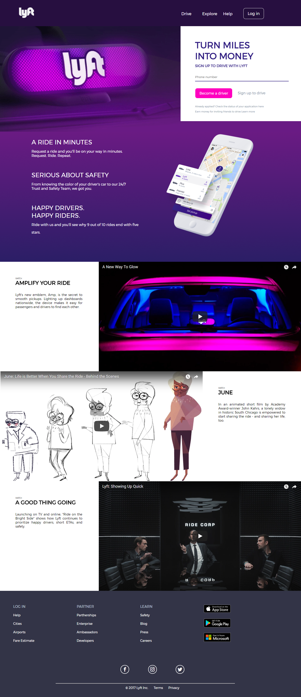

# Lyft
***

## Objetivo

El objetivo fue cumplir con la realización de la página web pero en grupos de dos personas.

## Integrantes

*Carla Centeno
*Ana Díaz

## Epecificaciones

* Página principal : `index.html` en el cual se encuentra la estructura html y los enlaces con las dos hojas de estilos utilizadas.

* En la carpeta `css` se encuentra el archivo `main.css` donde se encuentran los archivos del proyecto.

* Dentro de la carpeta `assets` se encuentra la carpeta `images` donde
  se encuentran las imágenes a utilizar y tambien se encuentra la carpeta `icon`la cual a su vez contiene otra carpeta llamada `icomoon`     la cual contiene los iconos descargados de esa misma pagina.

## Sobre la página web

* Tanto el index como el css se encuentran comentados para que sea fácil de entender

## Página web terminada

* Luego del proceso de desarrollo de la página web podemos mostrar los resultados:

